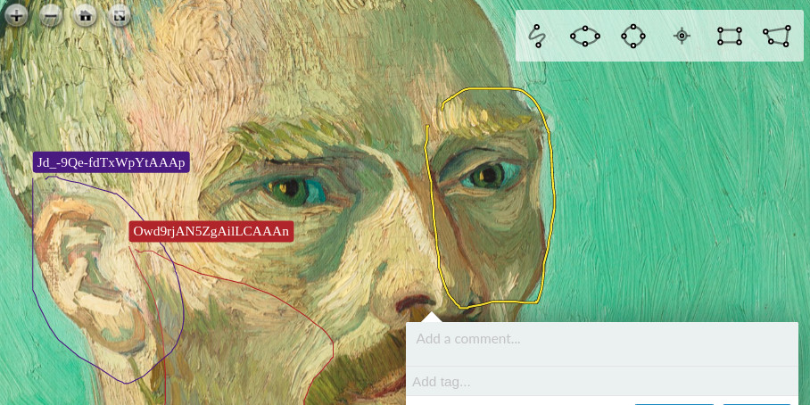

# Realtime Demo Site

Demo site for realtime collaborative annotation with Annotorious. Try here:

__<http://realtime-demo.annotorious.com>__

Real-time collaboration is powered by the experimental Annotorious
[Realtime Annotation Server](https://github.com/recogito/realtime-annotation-server).

__Want to know more? Deploy your own server? Contribute to further development? Get in touch via the 
[Annotorious Gitter chat](https://gitter.im/recogito/annotorious) or
[send me a DM via twitter](https://twitter.com/aboutgeo)!__

## Features

- GoogleDocs-like live collaboration
- Cloud-based permanent annotation storage

## TODOs

- JWT-based Authentication
- Map annotation with the [OpenSeadragon WMTS plugin](https://github.com/recogito/openseadragon-wmts)
- Test compatibility with OpenSeadragon v3

